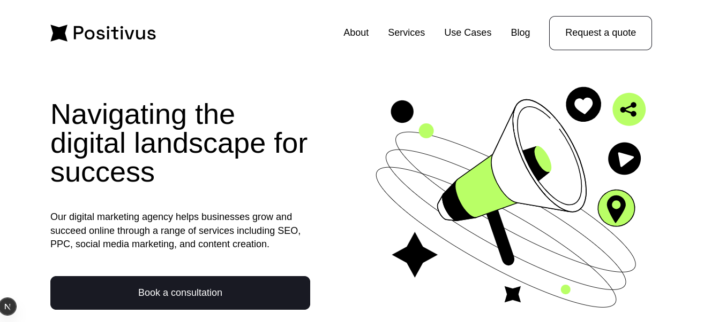

<p align="center">
   
</p>

# Positivus

#### :postbox: About

- Landing Page for Positivus, created with Next.js, Tailwind, TypeScript

#### :pushpin: Prototype

Template - [Figma](https://www.figma.com/design/40Fc50DMZxIZFIaA1zuZtb/Positivus-Landing-Page-Design-g-Community-?node-id=330-762&t=V5IfG1KPxCxpyTYh-0)

#### :rocket: Use Stack

- [TypeScript](https://www.typescriptlang.org/docs/handbook/typescript-in-5-minutes.html)
- [Next.js](https://nextjs.org/docs/getting-started)
- [Tailwind CSS](https://tailwindcss.com/)
- [Landing Page Deploy](https://positivus-free-5yuc.vercel.app/)

## Getting Started

First, run the development server:

```bash
npm run dev
# or
yarn dev
# or
pnpm dev
# or
bun dev
```

Open [http://localhost:3000](http://localhost:3000) with your browser to see the result.

#### 📱 Preview Dashboard

<p align="center">
<video src='https://github.com/user-attachments/assets/d0937cd4-98eb-416c-969d-8ba6bc886062' width=180/>

</p>
